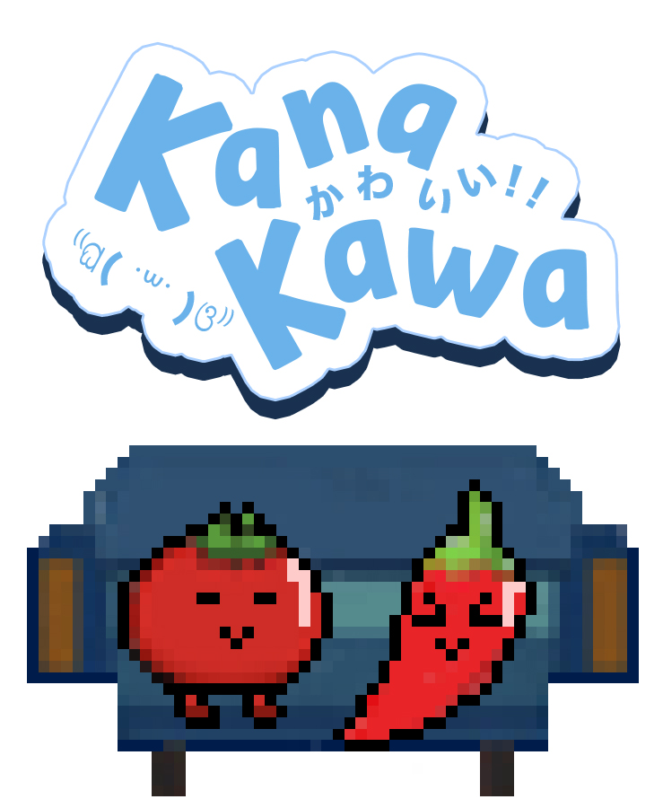

# KanaKawa!

Kana Kawa is a comic/illustration manager written in go.

---

## Introduction

We want to provide a simple and easy to use tool to manage your comics and illustrations, whatever it from websites or
you own scans.

## Features

+ [ ] Scan your local downloads into library.
+ [ ] Deduplicate images.
+ [ ] Edit metadata.
+ [ ] Integrated with stashapp/stash.